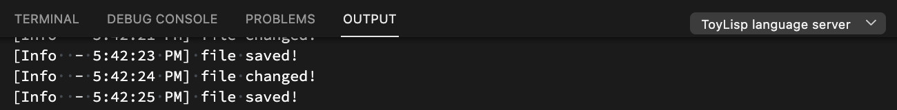
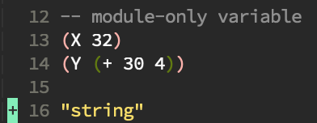
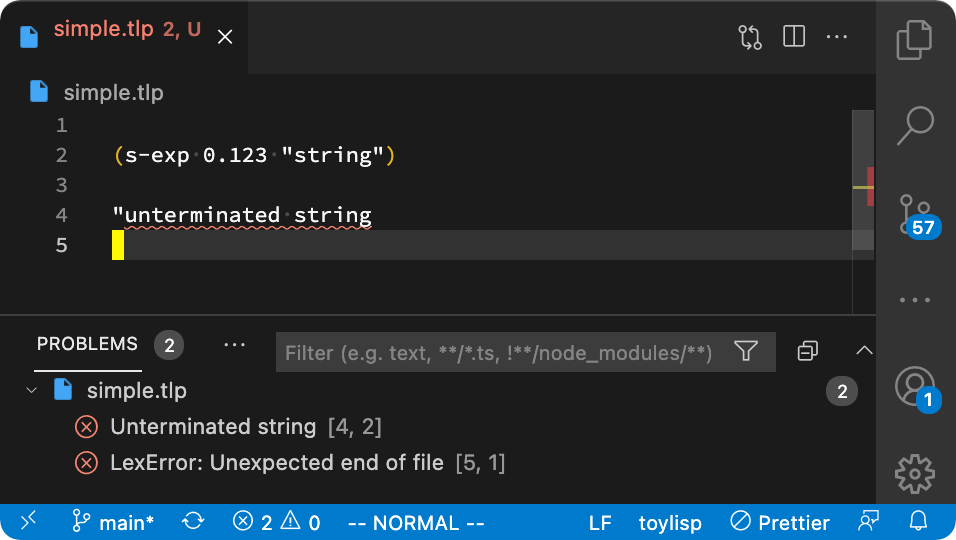

= toylisp devlog
:glsp: https://gamelisp.rs/[GameLisp]
:snowrl: https://github.com/toyboot4e/snowrl[SnowRL]
:cr: https://craftinginterpreters.com/contents.html[Crafting Interpreters]
:toy-scheme: https://github.com/toyboot4e/toy-scheme[toy-scheme]
:compilerbook: https://www.sigbus.info/compilerbook[compilerbook]

:ra: https://github.com/rust-analyzer/rust-analyzer[rust-analyzer]
:ra-arch: https://github.com/rust-analyzer/rust-analyzer/blob/master/docs/dev/architecture.md[architecture.md]
:ra-guide: https://github.com/rust-analyzer/rust-analyzer/blob/master/docs/dev/guide.md[guide.md]

:rowan: https://github.com/rust-analyzer/rowan/[rowan]
:rowan-s: https://github.com/rust-analyzer/rowan/blob/master/examples/s_expressions.rs[s_expressions.rs]
:salsa: https://github.com/salsa-rs/salsa[salsa]
:dada: https://github.com/dada-lang/dada[dada]

:tower-lsp: https://github.com/ebkalderon/tower-lsp[tower-lsp]
:lspower: https://github.com/silvanshade/lspower[lspower]
:tree-sitter: https://github.com/tree-sitter/tree-sitter[tree-sitter]

toylisp is a to-be DSL for my game SnowRL.

== Background

I wanted to add scripting support for my game ({snowrl}) and {glsp} looked nice, but it didn't have `:named arg` syntax. Then I suddenly wanted to make my own Lisp: toylisp (`tlp`).

I did {cr} (part II: tree-walk interpreter) in years ago. I made an Emacs package in ELisp ({toy-scheme}), still I know little about Lisp. I'd have to struggle a lot.

== Initial, abandoned approach

Compilation passes: source string → AST → bytecode. This approach was abandoned in favor of following `rust-analyzer`.

[%collapsible]
========

=== Lexer (tokenizer)

* Jun 9, 2021
+
I added a WIP lexer (tokenizer) which converts given string (`&str`) into a vector of tokens.
+
** The lexer handles non-streaming input/output for simplicity.
** The lexer handles UTF-8 string as bytes (as `&[u8])`, not as `Iterator<char>` because we're only interested in ASCII characters while lexing.
** Each token slices the source string with `ByteSpan { lo, hi }`.

* Jun 12, 2021
+
Just a note: nice resource from `rustc` dev guide: https://rustc-dev-guide.rust-lang.org/the-parser.html[Lexing and Parsing].

* Jun 17, 2021
+
I parsed `Vec<Token>` into a hierarchy of tokens. I'm not sure if it's good idea to stick with tokens and source string though; the API is already uncomfortable.

=== Compiler and bytecode virtual machine

* Jun 17, 2021
+
I added a simple VM which can calculate arithmetics. It's a stack-based VM as one in the book ({cr}).
+
I also added a simple compiler, which converts AST to bytecode. Now `(/ (- 64.0 32.0) 2)` evaluates to `16.0`.

========

== Setting up frontend

I started to learn from {ra}.

=== CST

I want my ideal lang to be statically typed, and the parser should be IDE-oriented. toylisp is not that language, still it would be great if I can learn from {ra}.

* Jun 21, 2021
+
Accoording to the doc, {ra} converts source file string into a lossless _(concrete) syntax tree_ with {rowan} footnote:[{rowan} was doing aggressive optimization: deduplication of subtree and use of thin pointers. I couldn't do better than that, so I decided to just use {rowan} instead of re-writing it.].
+
CST is a tree representation of text (syntax), where each element footnote:[element = sub tree (node) or leaf (token)] is tagged with _syntax kind_ s. One good thing about CST is that each element is _homogeneous_ and _untyped_, so we can easily create CST even for invalid source text in a grammer.
+
Today I parsed simple arithmetics into CST with {rowan}. I can't run the code yet (and for a while).

* Jun 25, 2021
+
In context of {rowan}, an AST node is just a wrapper around a CST node with accessor methods; AST node is always backed by a CST node!
+
Today I added a basic AST.

=== Language server and syntax highlighting (tree-sitter)

I'll develop both the language and a language server as the same time.

* Jul 1, 2021
+
I'm making a simple language server using {tower-lsp}. It got connected to VSCode:
+

+
Awesome!
+
Next thing to do was syntax highlighting. But as of today, LS can't provide syntax highlighting footnote:[It was wrong; see Jul 11, 2021].
+
OMG!
+
And every text editor uses different regular expression for highlights. But don't too worry, {tree-sitter} would be the write-once-run-everywhere syntax highlighter. I made a simple `tree-sitter` project and it runs on Emacs:
+

+
E p i c o !

* Jul 4, 2021
+
Summon EoF error!
+

+
There are lots more things to, such as syncing the buffers, but now the front-end development is ready, so every work could directly improve the user experience. Let's become a toylisp user!

* Jul 11, 2021
+
I hear _semantic tokens_ of language server can provide syntax highlighting _without_ highlighting by regex. But I could not let `semantic_highlight_full` called somehow. I'll leave it for later day.

== HIR

=== Introducing `salsa`

* Jul 17, 2021
+
{ra} is built around {salsa}. {salsa} is an incremental computation framework. I expect it be a wizard's magic, like {rowan} is!
+
By the way, {rowan} and {salsa} are written in 4,000 lines of Rust. I also counted `rust-analyzer` source lines:
+
[%collapsible]
====
[source]
----
crate            lines
----------------------
base_db          1014
cfg              781
flycheck         347
hir              5695
hir_def          21240
hir_expand       3579
hir_ty           26269
ide              26290
ide_assists      33940
ide_completion   14292
ide_db           14116
ide_diagnostics  4427
ide_ssr          3798
mbe              5458
parser           4886
paths            227
proc_macro_api   766
proc_macro_srv   3830
proc_macro_test  3
profile          716
project_model    2111
rust-analyzer    13137
stdx             542
syntax           11753
test_utils       1333
text_edit        186
toolchain        60
tt               497
vfs              881
vfs-notify       219
----
====

=== `hir_def` not implemented

* Aug 1, 2021
+
Me of this day tried to make notes about ra `hir-def`, but it looked too complex to wrap my head around it.

* Aug 28, 2021
+
https://mun-lang.org/[Mun Programming Language] has https://docs.mun-lang.org/[document] where Salsa integration is explained.

=== `hir_def` implemented

* Aug 21, 2022
+
Hey it took me a year to come back to toylisp. I learned incremental development from the {compilerbook} and I made up `tlp::hir_def`. Now I can run a simple toylisp program:
+
[source,lisp]
----
(proc main ()
    (let a 10)
    (+ a 2))
;; => 2
----
+
The module hierarchy shows how I understand `hir_def` today. It's basically abount items and bodies:
+
----
[source]
hir_def
├── body
│   ├── expr.rs
│   ├── expr_scope.rs
│   └── pat.rs
├── db
├── ids
├── item_list
│   └── item.rs
└── lower
    ├── collect_item_scope.rs
    ├── lower_body.rs
    └── lower_item.rs
----
+
Hey it looks very simple.

=== (Not) Looking into `hir_ty`

I want to add support for basic primitive types: `i32`, `f32` and `bool`. I need to know the type of variable to apply suitable arithmetic operators, so I'll tuckple into ra `hir-ty`.

* Aug 21, 2022
+
`hir_ty` database returns `InferenceResult`, which assignes type information to every expression and pattern:
+
[source,rust]
----
#[derive(Debug)]
pub struct InferenceResult {
    // Its's basically:
    pub type_of_expr: ArenaMap<Idx<Expr>, Ty>,
    pub type_of_pat: ArenaMap<Idx<Pat>, Ty>,
}
----
+
First I'll try to make it. Not scared, I'm in incremental development mode.

=== `salsa-2022`

* Aug 29, 2022
+
`salsa-2022` is coming! https://github.com/salsa-rs/salsa/issues/305[Tracking issue]. The only advanced code base based on it out there is {dada}. I looked into {dada} and got the basic idea of `salsa-2022`.
+
In the context of `rust-analyzer`, `salsa-2022` *much* simplifies the `hir_def` crate. *We don't have to keep holding `ItemTree`*. Each `Item` is indexed by their `name` as `#[id]`. And that's it. The item IDs keep pointing to the same item. It's even stable when items are reordered.
+
Accessing ID-relevant data is trivial. I'm re-implementing `hir_def` alternative (just called `ir`), and here's a simple test case:
+
[source,rust]
----
use tlp::Db;

#[test]
fn items() {
    let db = &mut Db::default();

    let src = r"(proc f ())
                (proc g ())
                (proc h ())";

    let f = db.new_input_file("main.tlp", src.to_string());
    let items = f.items(db);

    assert_eq!(
        &items
            .iter()
            .map(|i| i.name(db).as_str(db))
            .collect::<Vec<_>>(),
        &["f", "g", "h"],
    );
}
----
+
Wow it's too easy! I'm liking `salsa-2022`.

* Sep 23, 2022
+
I implemented a bunch of basic language constructs, along with a simple type inference system. For example, the following codes work today:
+
[source,rust]
----
;; We have `let`, `while`, comparison operators and `set`:
(let a 0)
(while (< a 3)
    (set a (+ a 1)))
;; => 3
----
+
[source,rust]
----
;; Function call works:
(proc fib (x)
    (cond ((= x 0) 0)
          ((= x 1) 1)
          (true (+ (fib (- x 1)) (fib (- x 2))))))

(proc main ()
    (fib 10))
----
+
The type inference system is roguhly based on the https://esumii.github.io/min-caml/index-e.html[MinCaml crash course]. It often works as type validation system without much inferencing.
+
The idea to to compare expression types with expected types. For example, the predicate of `while` expression must have `bool` type. If not, we emit an error and continue the analysis. More interesting case would be `cond`. If `cond` is an expression, each `cond` case must return the same type. And because `cond` cases must be comprehensive, we require `true` case.
+
Function parameter types are restricted to `i32` for now. I will add syntax for annotating parameter types.

